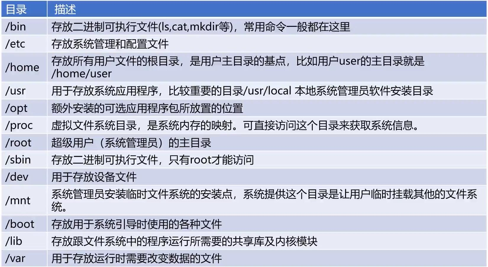

## Linux 进程管理

### 1. 进程的类型

1. 前台进程：具有终端，可以和用户交互
2. 后台进程：没有占用终端，基本上不和用户交互，优先级比前台低
3. 守护进程：特殊的后台进程，系统引导时启动，直到系统关闭

### 2. 进程的标记

#### 进程的ID

1. ID是唯一标记，最大值由操作系统限定
2. ID为 0 的进程为idle，系统的第一个进程
3. ID为 1 的进程为 init 进程，是 idle 的子进程， 是所有用户进程的祖先进程

#### 进程的状态标记

### 3. 操作 linux 进程的命令

1. ps
2. top
3. kill

## 进程调度

### 1. 概述

1. 计算机通过决策决定那个就绪进程可以获得CPU使用权
2. 步骤：a. 保留旧进程的运行信息，请出旧进程；b.准备环境给新进程
3. 非抢占式调度和抢占式调度

### 2. 进程调度的算法

1. 先来先服务

2. 短进程优先：不利于长作业执行
3. 高优先权优先
4. 时间片轮转

## 死锁

### 1. 是什么

### 2. 产生

1. 竞争资源
2. 进程调度顺序不当

### 3. 必要条件

1. 互斥
2. 请求保持
3. 不可剥夺
4. 环路等待

### 4. 死锁的处理

1. 预防死锁：破坏必要条件
2. 银行家算法

## 内存分配和回收

### 1. 方式

1. 单一连续分配
2. 固定分区分配
3. 动态分区分配：动态分区空闲表；动态分区空闲链

### 2. 动态分区分配算法

1. 首次适应算法（循环适应算法）
2. 最佳适应算法
3. 快速适应算法

### 3. 内存回收的过程

## 段页式存储管理

### 1. 页式存储管理

1. 页面：逻辑空间（等分）
2. 内存碎片
3. 页表：记录逻辑空间和物理空间的映射（页面和字块映射）
4. 缺点：逻辑空间（32、64位）大了，页表很占用空间；分散
5. 解决：多级页表

### 2. 段式存储管理

1. 逻辑空间分成若干段（非等分）
2. 段表：基址 + 段长来映射

### 3. 段页式存储管理

1. 分页能提高内存利用率
2. 分段能更好满足用户需求
3. 先分段，再分页

## 虚拟内存

### 1. 虚拟内存概述

### 2. 程序的局部性原理

1. 程序运行时装载部分即可
2. 访问页不存在的时候，发出缺页中断，发起页面置换

### 3. 虚拟内存的置换算法

1. FIFO
2. LFU
3. LRU

## Linux的储存管理

### 1. Buddy 内存管理算法

1. 主要为了解决内存“外碎片”的问题
2. 页内碎片：已分配的空间大于实际使用空间；页外碎片：没有被分配，但是太小了无法分配出去
3. 分配原则：向上取整到 2 的次幂大小
4. 伙伴系统：伙伴：相邻的另外一片大小一样的连续内存
5. 流程：a. 创建一系列空闲链表，每一种都是 2 的次幂大小；b. 分配...；c. 回收...
6. 内存外碎片问题转移成了内存内碎片

### 2. Linux 交换空间

1. 冷启动内存依赖
2. 系统睡眠依赖
3. 大进程空间依赖
4. Swap 和虚拟内存的区别：Swap 是系统概念（Linux 系统的概念），虚拟内存是进程概念；Swap 是解决系统物理内存不足的问题，虚拟内存是解决进程物理内存不足。

## 操作系统的文件管理

### 1. 文件的逻辑结构

1. 有结构文件：由定长记录 + 可变长记录组成
2. 无结构文件：（二进制文件、链接库）
3. 顺序文件：（磁带只能存储顺序文件）存储效率最高，修改很低效
4. 索引文件：索引表

### 2. 辅存的储存空间分配

1. 连续分配：读取文件速度快，要求满足容量的连续储存空间
2. 链接分配：存储在离散的盘块中。a. 隐式链接（适合顺序访问，随机访问效率低，可靠性差）；b. 显示链接（FAT表，不支持高效的直接存储，需要将整个FAT加载到内存来检索）
3. 索引分配：把文件所有索引集中存储；可以直接访问盘块，文件较大时有明显优势
4. 存储空间分配：
   - 空闲表
   - 空闲链表：把所有的空闲盘去组成一个空闲链表
   - 位示图：（主要使用）每个盘块用 0 和 1 标记。维护成本低，容易找到空闲盘块，占用空间小
5. 目录管理：目录树，使任何文件和目录都有唯一路径

## Linux文件基本操作

### 1. Linux 目录

1. Linux 系统目录
	
	
	
2. 相对路径

3. 绝对路径

### 2. Linux 文件常用操作

1. touch 命令：创建文件
2. vi、vim：编辑文件
3. cat：查看文件
4. rm：删除文件、文件夹（sudo rm -rf /)
5. mkdir: 创建文件夹

### 3. Linux 文件类型

1. 套接字（s)
2. 普通文件（-）
3. 目录文件（d)
4. 符号链接（l)
5. 设备文件（c：字符设备；b：块设备）
6. FIFO（p）

